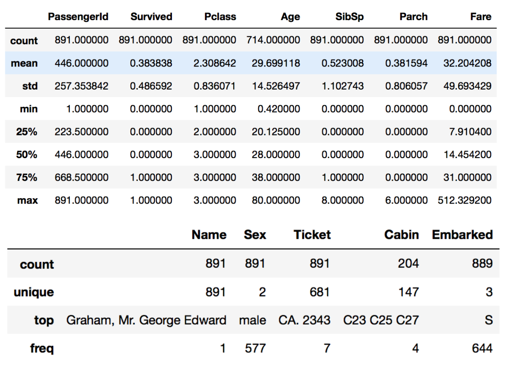

#### Basic

##### 题目

> 将一个列表内的所有数字从小到大排序，并且分离所有的奇数偶数，将奇数放置于最前方

```python
def leap(nums):
    # Todo
    pass

assert(leap([5,4,3,2,1]) == [1,3,5,2,4])
assert(leap([2,0,1,9,0,6]) == [1,9,0,0,2,6])
print("Passed all tests!")
```

##### 参考答案

```python
def leap(nums):
    sorted_nums = sorted(nums)
    odds = []
    evens = []
    for num in sorted_nums:
        if num % 2 == 0:
            evens.append(num)
        else:
            odds.append(num)
    return odds + evens
```


#### Dictionary

##### 题目

> 城市陷入了混乱！人们的分身出现在了不同的街道上。
>
> 我们城市护卫队的任务就是统计出每个人究竟有多少分身还在街上游荡。
>
> 函数 chaos 应当接收一个 dictionary，key 为街道名称，value 为一个包含在这条街上的人的 list
>
> chaos 应当返回一个统计结果的 dictionary，key 为人名，value 为他的分身数量

```python
def chaos(state):
    # Todo

assert(chaos({
    "1st ave": ["A", "B", "C"],
    "2rd ave": ["C", "D", "F", "B"],
    "3th ave": ["F", "A"],
    "4th ave": ["D", "E", "B"]
}) == {
    "A": 2,
    "B": 3,
    "C": 2,
    "D": 2,
    "E": 1,
    "F": 2
})
print("Passed all tests!")
```

##### 参考答案

```python
def chaos(state):
    stats = {}
    for ave in state:
        for person in state[ave]:
            if not person in stats:
                stats[person] = 0
            stats[person] += 1
    return stats
```


#### Numpy

##### 题目

> Numpy是机器学习中经常需要用的数据处理工具
>
> Numpy的很多功能并不需要记忆，但是我们希望你有**检索**到你想用的功能的能力
>
> Documentation在此处：<https://docs.scipy.org/doc/numpy/reference/>
>
> 你也可以利用任何搜索引擎，关键字，来检索到我们要求你使用的功能，上面列出的文档并不是强制使用的唯一资料。
>
> 前8道每题0.5pt，9-11每题2pt,
>
> 请运用numpy语法解决以下问题：(默认import numpy as np, 注意语法)

创建2*5的全1矩阵

```python
print(#todo)
```

创建3*4的全0矩阵

```python
print(#todo)
```

创建5阶单位矩阵

```python
print(#todo）
```

创建2*2空矩阵

```python
print(#todo)
```

>  以下数据为第5-10题所用

```python
import numpy as np

countries = np.array([
    'Afghanistan', 'Albania', 'Algeria', 'Angola', 'Argentina',
    'Armenia', 'Australia', 'Austria', 'Azerbaijan', 'Bahamas',
    'Bahrain', 'Bangladesh', 'Barbados', 'Belarus', 'Belgium',
    'Belize', 'Benin', 'Bhutan', 'Bolivia',
    'Bosnia and Herzegovina'
])

employment = np.array([
    55.70000076,  51.40000153,  50.5       ,  75.69999695,
    58.40000153,  40.09999847,  61.5       ,  57.09999847,
    60.90000153,  66.59999847,  60.40000153,  68.09999847,
    66.90000153,  53.40000153,  48.59999847,  56.79999924,
    71.59999847,  58.40000153,  70.40000153,  41.20000076
])
```

Countries数组的element type

```python
print #todo
```

Employment数组的平均值

```python
print #todo
```

Employment数组的标准差

```python
print #todo
```

Employment数组的最大值

```python
print #todo
```

找到最高的就业率和对应的国家(请不要自己写算法)

```python
def max_employment(countries, employment)
		#todo
```

归一化Employment

```python
def standardize_data(employment):
    standardized_values = #todo
    return standardized_values
```

> 以下题目需要用到一些数据，称之为titanic，以下为这个数据的基本信息，你也可以自己研究它(附件有提供)
>
> 

请用Numpy语法研究性别对生存率的影响

```python
		#自由发挥
```

##### 参考答案

```python
np.ones((2,5))
np.zeros((3,4))
np.eye(5)
np.empty(2,2)
countries.dtype
employment.mean()
employment.std()
employment.max()
employment.sum()

i = employment.argmax()
return (countries[i], employment[i])

standardized_values = (employment - employment.mean()) / employment.std()

titanic[['Survived','Sex']].groupby('Sex', as_index=False).mean()
#最后一题其实言之有理即可叭
```


#### Interpreter

##### 题目

> 准备好迎接挑战了吗？
>
> 这道题要求你实现一个简单的"解释器"来执行一段代码
>
> 
>
> 例子：
>
> ```
> a = 1
> b = 2
> c = add a, b
> d = multiply a, c
> return d
> 
> // 这段代码应返回 3
> ```
>
> 
>
> 在我们的解释器中，需要支持设定变量为整数，以及 add 和 multiply 两个内置方法。
>
> 同时，代码的空格可能会杂乱无章，比如像这样：
>
> ```
> a =  1
> b  = 2
>   c = add a, b
> d = multiply   a ,  c
>  return  d
> ```
>
> 在以上这种情况下，仍然要保证代码可以被正确执行。
>
> 
>
> 祝你好运！

```python
def interpreter(code):
    # Todo
    
def code_template_1(a, b):
    code = [
        "a =  {}".format(a),
        "b  = {}".format(b),
        "  c = add a, b",
        "d = multiply  a, c",
        "return d"
    ]
    return "\n".join(code)

def code_template_2(a, b, c):
    code = [
        "a = {}".format(a),
        "b = {}".format(b),
        "c = {}".format(c),
        "m = multiply a, c",
        "q = add m, b",
        "z = multiply q, a",
        "return z"
    ]
    return "\n".join(code)

assert(interpreter("") == 0)
assert(interpreter(code_template_1(1, 2)) == 3)
assert(interpreter(code_template_1(2, 3)) == 10)
assert(interpreter(code_template_2(4, 5, 6)) == 116)
assert(interpreter(code_template_2(3, 1, 5)) == 48)
print("Passed all tests!")
```

##### 参考答案

```python
def interpreter(code):
    lines = code.split("\n")
    hashmap = {}
    for line in lines:
        line = line.strip()
        if line.find("=") > 0:
            pos_equ = line.find("=")
            varname = line[0:pos_equ].strip()
            expression = line[pos_equ + 1:].strip()
            func = ""
            if "add" in expression:
                func = "add"
            elif "multiply" in expression:
                func = "multiply"
            if func == "":
                hashmap[varname] = int(expression)
            else:
                params = expression[len(func):].strip().split(",")
                a = params[0].strip()
                b = params[1].strip()
                if func == "add":
                    hashmap[varname] = hashmap[a] + hashmap[b]
                elif func == "multiply":
                    hashmap[varname] = hashmap[a] * hashmap[b]
        elif line[0:7] == "return ":
            retvar = line[7:].strip()
            return hashmap[retvar]
    return 0
```

